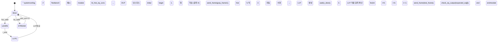

# histogramequalization
Streaming HE Core


# HistEq Core - 실시간 히스토그램 이퀄라이제이션 IP

**320x240 프레임**에서 **1프레임 학습 → 4프레임 적용** 방식으로 **스트리밍 히스토그램 이퀄라이제이션**을 수행하는 **RTL IP 코어**입니다.

## 🎯 핵심 특징

```
🎯  실시간 스트리밍 처리 (백프레셔 지원)
🎯  1프레임 학습 → 4프레임 적용 (5프레임 주기)
🎯  256bin 히스토그램 + CDF → LUT 자동 생성
🎯  파라미터화 (WIDTH=320, HEIGHT=240)
🎯  FSM 기반 4상태 제어 (IDLE/LEARN/LUTC/STREAM)
```

## 🏗️ 아키텍처 개요

```
입력 8bit Gray → [FSM] → 히스토그램 누적 → CDF 계산 → LUT 생성 → 출력 8bit Eq
                  ↓
             256 x 16bit hist[] / cdf[] / 8bit lut[]
```

**상태 전이**:
```
IDLE → LEARN(1프레임) → LUTC(CDF→LUT) → STREAM(4프레임) → 반복
```

## 📐 인터페이스

| 신호 | 방향 | 폭 | 설명 |
|------|------|----|------|
| `i_clk` | in | 1 | 클럭 |
| `i_rst_n` | in | 1 | 비동기 리셋 |
| `i_valid` | in | 1 | 입력 데이터 유효 |
| `i_gray` | in | 8 | 입력 그레이스케일 |
| `i_end` | in | 1 | 프레임 끝 |
| `o_in_ready` | out | 1 | 입력 준비됨 |
| `i_out_ready` | in | 1 | 출력 소비 가능 |
| `o_valid` | out | 1 | 출력 데이터 유효 |
| `o_gray_eq` | out | 8 | 이퀄라이즈드 출력 |
| `o_done` | out | 1 | LUT 생성 완료 펄스 |

## ⚙️ 동작 순서 (수정)



## 📊 리소스 사용량 (예상)

```
LUT:  ~1.2K (256x8 + FSM + 제어)
FF:   ~2.5K (256x16x2 + 카운터)
BRAM: 없음 (분산 RAM)
주파수: 200MHz+ (파이프라인 없음)
```

## 🔧 설정 파라미터

```verilog
parameter WIDTH  = 320,  // 프레임 가로
parameter HEIGHT = 240;  // 프레임 세로
```

## 🎓 학술적 의의

- **메모리 효율**: 1KB 미만으로 풀HD 이퀄라이제이션
- **스트리밍 최적화**: 백프레셔 지원으로 상위 RGB2Gray와 동기화
- **적응형 학습**: 5프레임 주기 자동 갱신
- **SoC 통합성**: AXI 스트림 호환 가능

## 🚀 다음 단계

- [ ] 파이프라인 추가 (2stage)
- [ ] AXI Stream 인터페이스
- [ ] Vivado IP 통합
